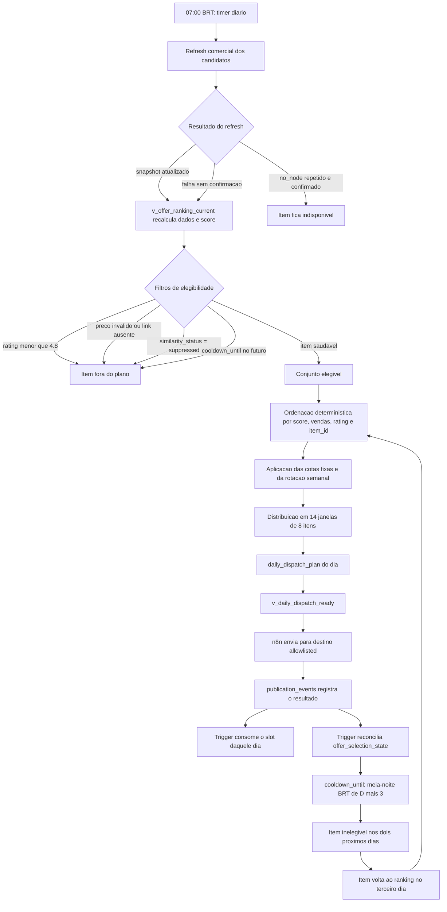

# Decisao de arquitetura MVP Supabase e n8n

## Evolucao vigente para feminino

O fluxo direto pelo ranking permanece como registro do MVP inicial, mas deixou
de ser o contrato de selecao do grupo `feminino`. A operacao atual prepara uma
fila diaria persistida antes do n8n:

```text
shopee-candidate-refresh.timer (07:00 BRT)
  -> refresh/rechecagem Shopee
  -> planejador de bandas e rotacao
  -> offers.daily_dispatch_plan
  -> offers.v_daily_dispatch_ready
  -> n8n monta, envia e registra publication_events
```

Refresh e planejamento pertencem ao mesmo service `systemd` e ao mesmo lock.
O planejamento so comeca depois que o refresh e sua pos-etapa opcional terminam
com sucesso; nao existe um segundo agendamento para gerar a fila.

O n8n executa de hora em hora entre `08h` e `21h` e consome `8` slots prontos.
Ele nao decide banda, rotacao, fallback ou ordenacao diaria. O vinculo
`publication_events.dispatch_plan_id` controla o consumo idempotente do slot.

Este documento e a decisao canonica do MVP operacional.

Estado observado como padrao vigente em `2026-08-14`:

- o `feminino` opera por `offers.daily_dispatch_plan` e
  `offers.v_daily_dispatch_ready`;
- o planejador carrega candidatos apenas de `offers.v_offer_ranking_current`
  com `is_eligible = true`;
- `offers.publication_events` e a fonte historica da verdade para envios;
- confirmacoes novas de `feminino/shopee` sao projetadas em
  `offers.offer_selection_state` por trigger;
- `cooldown_until` retira o item dos dois proximos dias operacionais, de forma
  global para o perfil e independente de destino/canal;
- a reconstrucao historica permanece separada da migration e so pode rodar
  entre `21h` e `07h`, preservando a fila materializada em andamento;
- tudo que dependia do fluxo direto `ranking -> n8n -> anti-repost por query`
  deve ser lido como legado.

## Fluxograma vigente: refresh, ordenacao e publicacao



O refresh nao e uma descoberta de novos produtos nem uma regra de diversidade.
Ele revalida os dados comerciais dos candidatos existentes e pode retirar um
item que deixou de ser comercialmente valido. Se o produto continuar saudavel,
o refresh preserva sua capacidade de competir pelo topo do ranking.

A ordenacao usada para carregar candidatos e estavel: `commercial_score desc`,
`sales_count desc`, `rating desc nulls last` e `item_id`. Em seguida, o
planejador escolhe os primeiros itens de cada subnicho conforme as cotas e os
espalha pelas janelas. A diversidade temporal agora entra antes dessa etapa,
pela elegibilidade calculada a partir de `cooldown_until`.

## Politica de diversidade entre dias

O fluxo responde separadamente se o item esta saudavel e se foi publicado
recentemente. Uma confirmacao com `sent_at` preenche `last_sent_at`,
`selected_at`, `selection_count` e `cooldown_until` em
`offers.offer_selection_state`. O ranking continua usando apenas
`is_eligible`, sem consultar o ledger nem esconder uma subquery temporal no
planejador.

A regra usa dias de calendario em `America/Sao_Paulo`, nao uma janela movel de
48 horas. Um item publicado no dia `14` fica fora dos planos dos dias `15` e
`16` e retorna no dia `17`; seu `cooldown_until` sera `17 00:00 BRT`.

Leitura real do banco em `2026-08-14`, sem escrita:

- os planos de `2026-08-13` e `2026-08-14` tinham `112` itens cada e
  compartilhavam `110` itens (`98,2%`);
- dos `77` itens com envio confirmado em `2026-08-13`, `62` reapareceram no
  plano de `2026-08-14`;
- ate o momento da consulta, `16` itens tinham envio confirmado em
  `2026-08-14`, todos ainda apareciam como elegiveis e `2` ja haviam sido
  confirmados tambem no dia anterior;
- uma simulacao somente em memoria do plano de `2026-08-15`, usando o ranking
  atual, repetiu `110` dos `112` itens do plano de `2026-08-14`.

A evidencia motivou a politica atual. Em simulacao somente leitura, bloquear as
confirmacoes dos dois dias anteriores ainda deixou `28.207` candidatos
elegiveis, gerou os `112` slots e manteve pelo menos `214` candidatos de folga
no subnicho mais restrito entre os selecionados.

`publication_events` permanece autoritativo e `offer_selection_state` e uma
projecao reconstruivel. A migration nao executa backfill automaticamente: novas
confirmacoes passam a ser projetadas imediatamente, enquanto
`scripts/supabase/rebuild_publication_cooldown.py` reconcilia o historico
somente fora da janela diaria.

Ele substitui, para a fase atual, a leitura anterior baseada em Supabase +
Cloud Run. Cloud Run permanece como evolucao futura ou ponte tecnica opcional,
mas nao e requisito para colocar o MVP em operacao.

## Decisao registrada

O fluxo oficial do MVP para `feminino` passa a ser:

```text
Catalogo ativo no Supabase
  -> cron atualiza snapshots e persiste a fila diaria
  -> n8n consulta offers.v_daily_dispatch_ready
  -> n8n monta mensagem
  -> n8n envia para allowlist
  -> Supabase registra historico
```

## Por que esta decisao existe

O projeto ficou denso demais para a fase atual. O MVP precisa provar a operacao
minima antes de ampliar a arquitetura.

Neste momento, o valor esta em:

- usar o catalogo que ja foi publicado no Supabase;
- selecionar ofertas elegiveis sem reexecutar descoberta;
- montar mensagens simples;
- enviar apenas para destinos controlados;
- registrar historico auditavel.

## Responsabilidades

### Supabase

Supabase e a fonte de verdade do MVP para:

- catalogo ativo;
- ranking e elegibilidade;
- fila diaria persistida;
- historico de tentativas e envios.

### n8n

n8n e o orquestrador do MVP para:

- iniciar a rodada;
- consultar a janela corrente em `offers.v_daily_dispatch_ready`;
- consumir ate `8` slots planejados por rodada;
- montar `message_text`;
- validar allowlist de destino;
- enviar pelo canal configurado;
- gravar resultado em `offers.publication_events`.

Hospedagem proposta para o MVP:

- n8n self-hosted em VPS da Hostinger;
- acesso operacional ao servidor via VSCode Remote SSH;
- credenciais, `.env`, chaves, sessoes, QR codes e tokens ficam apenas na VPS
  ou no painel seguro do servico correspondente;
- o repositorio versiona workflow exportavel, payloads de exemplo,
  documentacao e scripts de apoio, mas nao segredos.

### Repositorio

O repositorio guarda:

- migrations;
- contratos de dados;
- documentacao;
- scripts locais de apoio;
- referencias de template e regras.

### Cloud Run

Cloud Run nao faz parte do caminho obrigatorio do MVP.

Ele pode voltar depois se houver necessidade de:

- reduzir logica dentro do n8n;
- centralizar selecao/copy em Python;
- expor endpoints estaveis para workflows;
- escalar processamento fora do n8n.

## Contrato legado da query MVP

Antes da fila persistida, o n8n consultava `offers.v_offer_ranking_current` com
filtros explicitos e excluia ofertas ja confirmadas para o mesmo destino logico
e canal. Isso evitava repostar o mesmo `stable_key` quando o topo do ranking
permanecia igual entre rodadas.

```sql
select
  profile,
  marketplace,
  stable_key,
  item_id,
  product_name,
  offer_link,
  price,
  reference_price,
  rating,
  sales_count,
  primary_subniche,
  commercial_score,
  score_reasons,
  rank_profile,
  rank_subniche
from offers.v_offer_ranking_current ranking
where ranking.is_eligible = true
  and ranking.profile = :profile
  and ranking.marketplace = :marketplace
  and not exists (
    select 1
    from offers.publication_events event
    where event.profile = ranking.profile
      and event.marketplace = ranking.marketplace
      and event.stable_key = ranking.stable_key
      and event.target = :target
      and event.channel_adapter = :channel_adapter
      and event.delivery_status = 'confirmed'
  )
order by
  rank_profile nulls last,
  commercial_score desc,
  sales_count desc,
  rating desc nulls last,
  item_id
limit :limit;
```

`delivery_status = 'confirmed'` era a fronteira anti-repost do MVP inicial.
Dry-runs e bloqueios de allowlist gravados como `cancelled` nao removiam a
oferta do ranking futuro.

Essa query permanece como registro historico, nao como contrato vigente do
`feminino`. O workflow atual nao deve voltar a selecionar diretamente do
ranking nem ser descrito como se ainda aplicasse essa trava no caminho real.

## Escopo preservado e legado

Ao migrar do fluxo direto por query para a fila diaria persistida, o projeto
ganhou previsibilidade operacional e recompos o anti-repost temporal sem
devolver a selecao ao n8n:

- `publication_events` guarda o historico e permite reconstruir a projecao;
- `offer_selection_state` governa a reentrada pelo `cooldown_until`;
- a protecao e global em `feminino/shopee`, por decisao operacional, e nao por
  `target` ou `channel_adapter`;
- o slot diario continua idempotente por `dispatch_plan_id`;
- a camada de similaridade continua operante, porem hoje tambem mascara parte
  da contaminacao semantica da taxonomia do `feminino`, o que reduz a clareza
  entre "duplicidade legitima" e "item fora do perfil".

O filtro direto em `publication_events` por destino/canal permanece apenas como
registro do MVP inicial.

## Seguranca do MVP

- Credenciais ficam no n8n/Supabase, nunca no Git.
- O envio real so pode acontecer para destinos em allowlist.
- O workflow deve bloquear destino ausente da allowlist.
- O texto deve conter disclosure de afiliado.
- O registro em `publication_events` deve ser idempotente.
- O anti-repost temporal e global para `feminino/shopee` e usa dois dias
  operacionais completos.

## Melhorias fora do MVP

- Automatizar coleta e atualizacao do catalogo.
- Revisar nichos e subnichos.
- Reaproveitar os codigos existentes de descoberta e classificacao semantica,
  porque eles ja rodam; quando essa frente entrar, o trabalho deve ser
  simplificar o fluxo, reduzir acoplamento e melhorar qualidade operacional,
  nao reescrever do zero.
- Calibrar score com evidencia de disparos.
- Criar revisao humana item a item.
- Mover partes do fluxo para Cloud Run.
- Adicionar dashboards e metricas de performance.
